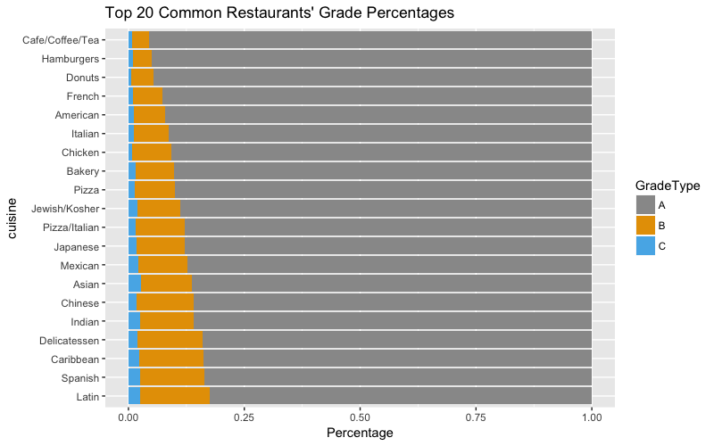

<style type="text/css">
body {
text-align: justify;
font-size: 12pt;
max-width: 1200px;
margin-left: 100px;
margin-right: 100px;
}
body .main-container {
max-width: 1200px;
font-size: 12pt;
}
</style>
## Introduction

NYC is a hub of diversity, yet there is one similarity that 8.5 million people shares – everyone eats. Over 26,000 eating establishments in the city (according to the NYC Department of Health and Mental Hygiene or DOHMH) thrives here because New Yorkers dine out over 58% of their lunches or dinners and spend $46.14 on average for each meal per person (Zagat Dining Trends Survey 2018). For these customers, ourselves included, the food that we purchase so frequently and at such high costs is a major factor influencing our health. To help people stay informed about food safety and the potential health risks that eating out poses, we conducted our research about restaurants in NYC based on DOHMH's source data hosted on Open Data.

For better visualization, we used CVD-friendly color theme and plotly for most of our graphs. To increase interactivity, we also incorporated d3 and google charts for missing values and restaurants with worst violation scores. 

*Team Members*: Cindy Wu, Julie Yu, Lisa Kim, Selina Tang

Cindy- data description, data quality, time series overview  
Julie- grade distributions and analysis  
Lisa- violation distributions and analysis  
Selina- restaurants case by case  

```{r echo=FALSE, message=FALSE, warning=FALSE}
### Packages and Libraries
library(knitr)
library(dplyr)
library(tidyverse)
library(skimr)
library(extracat)
library(lubridate)
library(xts)
library(plotly)
library(tidyr)
library(svglite)
library(viridis)
library(ggthemes)
```


## Dataset: NYC Restaurant Inspection Data
```{r, echo = FALSE}
#data <- read.csv('~/desktop/DOHMH_New_York_City_Restaurant_Inspection_Results.csv', header =T,stringsAsFactors=FALSE, fileEncoding="latin1")
load('~/EDAV/data/data.RData')
keep_cols <- c('DBA','BORO', 'ZIPCODE','CUISINE.DESCRIPTION','INSPECTION.DATE','VIOLATION.CODE','VIOLATION.DESCRIPTION','SCORE', 'GRADE','INSPECTION.TYPE')
data[data==""] <- NA
```
* Our [dataset][data] is collected from NYC Open Data along with a [data description][des] provided by the website

* 375,989 rows of data entries of NYC restaurant inspection information between June 2012 - April 2018

* Each row consists of 18 variables including (and not limited to) restaurant information (name, address, zipcode, borough, cuisine type), inspection results (inspection type, inspection date), violation details (violation code with corresponding violation description), and scorings (score, letter grade). For the sole purpose of efficiently visualizing inspection results, we only selected the most relevant and most representative 10 variables in the dataset to conduct further exploration. The ten vairbales this report focuses on are - DBA (restaurant name), borough, zipcode, cuisine description,inspection date,violation code, violation description, score, grade, and inspection type

* Variables Facts:
  - Score and Grade: 125 unique score in the dataset ranging from -2 to 151; higher score indicate worse violations; typically <=14 points converts to grade "A""; 14-27 points converts to grade "B", and 28+ points converts to grade "C"
  - Restaurant: 23,986 unique restaurants (based on restauant name and zipcode)
  - Violation: 77 unique violation codes (correspoding to 77 different types of violations)
  - Cuisine Type: 85 unique types of cuisine 
  - Borough: 5 boroughs of New York City (Manhattan, Bronx, Brooklyn, Queens, Staten Island)
  
* Since restaurants go in and out of business, the dataset only records restaurants that are still active in March 2018 (last inspection included in the data)

```{r, eval = FALSE, echo = FALSE}
min(unique(df$SCORE))
max(unique(df$SCORE))
length(unique(na.omit(df$DBA)))
unique(na.omit(df$BORO))
unique(df$CUISINE.DESCRIPTION)
df$A <- paste(df$DBA,"-",df$ZIPCODE)
length(unique(na.omit(df$A)))
```
## Data Quality

### Overview: Missing Data and data cleaning

**click [here][d3] to see interactive visna plots made with D3**

We first explore the distribution of missing data in the original dataset. As shown in the chart and plot, the most common missing pattern in the original data is Grade on its own with over 50% missing data, followed by only around 5% in scores and minor missing percentages in violation details. 

```{r,  fig_height=4, fig_width=6, eval = TRUE, echo = FALSE}
# entire dataset
df_org <- data %>% select(keep_cols)
skim(df_org) %>% filter(stat == "missing") %>% 
  arrange(desc(value)) %>% select(variable, type, value) %>% mutate(percent_missing = value *100/nrow(df_org))

```

From the official grading system in data description, we learned that the grades are converted from scores accroding to a specific scheme for every 'gradable' inspection, and only inspections of certain types are eligble to receive a grade. Due to the large amount of missing values in Grade, we pay more attention to scores and violation details since they are good and direct reflections of inspection results and contain much fewer missing data. 

In addition to grades, the data description also states that some scores are missing because there are new restarants that have yet to be inspected, and they are marked by "inspection.date = 01/01/1900". Therefore, we removed rows with new restaurants' and looked at missing values again. 

The second chart shows the missing value percentages for each variable after removing new restaurants. We see a decrease in missing scores and for our exploratory analysis, we removed all missing values in scores. 


```{r,  fig_height=4, fig_width=6, eval = TRUE, echo = FALSE, warning=FALSE, message=FALSE}
# new restaurants that have not been inspected
print(paste("Number of new restaurants:", nrow(data[data$INSPECTION.DATE == '01/01/1900',])))
df_1 <- data[data$INSPECTION.DATE != '01/01/1900',] %>% select(keep_cols)
skim(df_1) %>% filter(stat == "missing") %>% 
  arrange(desc(value)) %>% select(variable, type, value) %>% mutate(percent_missing = value *100/nrow(df_1))
```

The third chart summarizes the final data we used for the report. Although there are still many missing values in grades, we do not consider it bad data quality since they are intentionally left blank.The overall quality of the dataset seems quite promising at this point. 

```{r,  fig_height=4, fig_width=6, eval = TRUE, echo = FALSE}
# missing data after removing all new restaurants and missing scores
df <- filter(df_1,!is.na(SCORE))
skim(df) %>% filter(stat == "missing") %>%
  arrange(desc(value)) %>% select(variable, type, value) %>% mutate(percent_missing = value *100 /nrow(df))
```

```{r, eval = FALSE, echo = FALSE}
# code for visna plots for d3
svglite("images/missing_org.svg")
visna(df_org, sort = "b" )
dev.off()
svglite("images/missing_no_new.svg")
visna(df_1, sort = 'b')
dev.off()
svglite("images/missing_no_na.svg")
visna(df, sort = "b")
dev.off()
```

### A Closer Look: borough and inspection types

To ensure data quality and validify our further analysis, we inspect the data more closely based on two variables we are particularly interested in- boroughs and inspection types.

```{r,fig.show='hold', out.width='70%',warning=FALSE, message=FALSE}
# By borough
percent_missing1 <- df_1 %>% group_by(BORO) %>% 
  summarize(num_Restaurants = n(), num_Missing_Score = sum(is.na(`SCORE`))) %>% 
  mutate(percent_Missing_Score = round(num_Missing_Score/num_Restaurants, 2)) %>% 
  arrange(-percent_Missing_Score)

p1<- ggplot(percent_missing1)+
  geom_line(aes(x= BORO, y =percent_Missing_Score, group=1))+
  geom_point(aes(x= BORO, y =percent_Missing_Score))+
  ylim(0,0.15)+
  ggtitle("Missing data percentage by borough")+
  theme_grey(16)+
  scale_colour_colorblind()
p1 <- ggplotly(p1)
p1
# By inspection type
percent_missing <- df_1 %>% group_by(INSPECTION.TYPE) %>% 
  summarize(num_Restaurants = n(), num_Missing_Score = sum(is.na(`SCORE`))) %>% 
  mutate(percent_Missing_Score = round(num_Missing_Score/num_Restaurants, 2)) %>% 
  arrange(-percent_Missing_Score)

p2 <- ggplot(percent_missing)+
  geom_line(aes(x= INSPECTION.TYPE, y =percent_Missing_Score, group=1))+
  geom_point(aes(x= INSPECTION.TYPE, y =percent_Missing_Score))+
  ggtitle("Missing data percentage by Inspection Type")+
  theme_grey(16)+
  scale_colour_colorblind()
p2 <- ggplotly(p2)
p2
```
Each borough has very similar percentage in missing  values so it is fair to conclude that the data qulity of our dataset is identical across the city.

## Exploratory Data Analysis

The following time series plot gives a general overview of NYC restaurant cleanliness over the past five year. 

```{r time series, eval = TRUE, fig.show='hold', out.width='70%', message=FALSE, warning=FALSE}
df <- df[!duplicated(df[c('DBA', 'INSPECTION.DATE', 'GRADE')]),]
df$INSPECTION.DATE <- as.Date(as.character(df$INSPECTION.DATE),format="%m/%d/%Y")
ts <- xts(df$SCORE,df$INSPECTION.DATE)
quarterly <- apply.quarterly(ts, FUN =mean)
ts_df<- data.frame(date=index(ts),score = ts)
quarterly_df <- data.frame(date = index(quarterly), quarter_avg = quarterly)

p<-plot_ly(quarterly_df[quarterly_df$date> "2013-05-16" & quarterly_df$date < "2018-03-31" ,],
        x=~date, y=~quarter_avg,
        type = 'scatter',
        mode = 'lines+markers',
        hoverinfo = 'text',
        line = list(color = 'black'),
        text = ~paste("Quarter Date:",date,"<br> Average Score: ",round(quarter_avg))) %>%
  add_trace(x = ~date,y = ~quarter_avg, mode = 'markers',marker = list(size = 8), color = viridis_pal(option = "D")(1))%>%
        layout(title = "Quarter Average Score",showlegend = FALSE)
p
```

There is a clear pattern that the third quarter (Jul - Sept) has the highest average score each year. Thinking in terms of season and weather, since July, August and September are typically the hottest months in NYC, we can infer that there are more violations during the summer. In the next sections, we go into more details about inspection results and look for more interesting patterns from two main perspectives- grade and violations. 

```{r, eval= FALSE, echo = FALSE}
plot_ly(ts_df) %>%
  add_lines(x= apply.monthly(ts, FUN =mean)[,0], y=apply.monthly(ts, FUN =mean)[,1]) 
 quarterly_df <- data.frame(date = index(quarterly), quarter_avg = quarterly)
quarterly_df$year <- factor(year(quarterly_df$date))
quarterly[,0]
apply.monthly(ts, FUN =mean)[,0]
floor_date(ts_df$date, "month")

quarterly_df$year <- factor(year(quarterly_df$date))

aggregate(. ~yearmon(date),ts ,mean)
```

### Grades
```{r,child="final project.Rmd",message=FALSE, warning=FALSE}
```

In the following sections, we will dive deeper into different violations, scores, and some of our most frequented restaurants.

### Violations 
```{r,child="violation_code_count.Rmd",,message=FALSE, warning=FALSE}
```

### Restaurants by case
```{r,child="Restaurant_Case_ver2.Rmd",message=FALSE, warning=FALSE}
```

## Executive Summary

In this report we explore the NYC restaurant inspection results from 2013 to March 2018 provided by NYC Department of Health and Mental Hygiene (NYC DOHMH). Each inspection result entry includes information about the restaurant, a letter grade, a score, and violation details for that specific inspection. We start out with a general overview of average scores over the years, and dig deeper into different types of restaurants and look at patterns in grade distributions. Since grades are evaluated based on violations, we also look at different types of violations to find the worst/most common types of violations in our data. We then focus on specific restaurants/chains including the most popular ones and ones with the worst scores and violations to avoid.

By plotting the quarter average score, we see that the grades fluctuate but the third quarter (July to September) always has the highest (worse) aggregated mean score of the year. 

```{r, echo= FALSE,eval = TRUE, fig.show='hold', out.width='70%', message=FALSE, warning=FALSE}
p<-plot_ly(quarterly_df[quarterly_df$date> "2013-05-16" & quarterly_df$date < "2018-03-31" ,],
        x=~date, y=~quarter_avg,
        type = 'scatter',
        mode = 'lines+markers',
        hoverinfo = 'text',
        line = list(color = 'black'),
        text = ~paste("Quarter Date:",date,"<br> Average Score: ",round(quarter_avg))) %>%
  add_trace(x = ~date,y = ~quarter_avg, mode = 'markers',marker = list(size = 8), color = viridis_pal(option = "D")(1))%>%
        layout(title = "Quarter Average Score",showlegend = FALSE)
p
```

Intuitively, it seems like the during the summer months, restaurants tend to have more violations. But before we jump into any conclusions about NYC restaurant cleanliness, we examine the details of grades and violations. 

As customers of the restaurants in NYC, perhaps the most direct way to check if a restaurant is clean or not is by looking at the grade posts given by NYC DOHMH. Therefore, we include the study of grades versus restaurant types. The graph below shows the top 20 common types of restaurants in a descending order from top to bottom by the percentage of receiving an A among all restaurants of their own type. We see that the top 3 A percentages belong to Cafe/Coffee/Tea, Hamburgers, and Donuts. In addition, among the 20 common types of restaurants, European and American tend to have a higher A percentage while Asian and Latin tend to have a lower A percentage.



We also take a look at the overall distribution of violation codes to see what types of the regulations are frequently violated by the NYC restaurants. The following bar chart describes the frequency of each violation made by the NYC restaurants. Many of the regulations that are frequently violated by the restaurants are associated with the storage of foods. In fact, the violations associated with not holding cold food and hot food items at the appropriate temperature are ranked at top 6 and 8 respectively. Also, the restaurants are penalized for not storing and handling raw, cooked, or prepared foods appropriately. 

 

In addition, restaurants seem to make very frequently violations associated with the cleanliness of the restaurants. They are penalized for not well maintaining the non-food contact surface the most frequently. Also, the most surprising finding from this bar chart is that many of the restaurants have the problem with mice. In fact, the violation code related to living mice is ranked at 3, and is recorded 26794 times. Moreover, many of the restaurants seem to have the filth flies problem as well.

Lastly, we examine four specific cafe chains in NYC to see the cleanness of popular cafe such as Starbucks through its annual violation score variation. The plot below shows annual violation score versus for four chains Starbucks, Dunkin, Gregory, and Piccolo in each NYC boroughs.

 

Most of the chain stores are located in Manhattan. In 2018, the violation score of the three cafes Starbucks, Dunkin, Gregory receives only about 10 in mean violation score, relatively low throughout these 5 years interval.  expect Piccolo.For the recent three years, Piccolo, an Italian cafe located in Manhattan received the highest score and performed the worst compared to rest. Besides, comparing Starbucks and Dunkin in Brooklyn, Dunkin’ Donuts has a higher violation score. 


## Conclusion

This report explores NYC restaurant inspection results specifically focusing on grades and violations. The overall scores reamin similar in trends over the years and summer months tend to raise more violations. By visualizing grade distrubutions, we find the general pattern that European and American restaurants have better grades than Asian restaurants.From violation distributions, we learn that many restaurants are penalized for not storing food properly and not maintaning the space clean. Looking at specific chains, we find that they might not follow the food safety rules exactly. Nevertheless in popular cafe such as Starbucks, we observe the attempt for improvement, a decreasing trend in the frequent violation across years.

All in all, this report should help give readers a better understanding of the grades we see at restaurants and some insights on different types of violations to look out for. It is important to be aware of the potential health risks when going to restarants since they might not be as clean as we think. As enjoyable as restaurant dining experiences could be, it never hurts to be a bit more cautious. On a positive note, we are hopeful that restaurants/cafes are working towards improving food safty and providng more wholesome dining environment. 


[data]: https://data.cityofnewyork.us/Health/DOHMH-New-York-City-Restaurant-Inspection-Results/xx67-kt59?category=Health&view_name=DOHMH-New-York-City-Restaurant-Inspection-Results
[des]: data/about.pdf
[d3]: images/missing_val.html